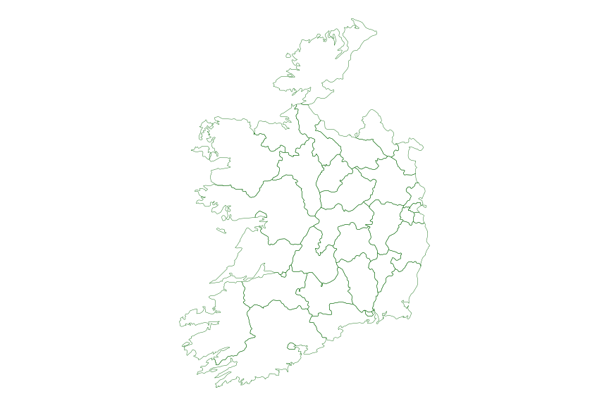
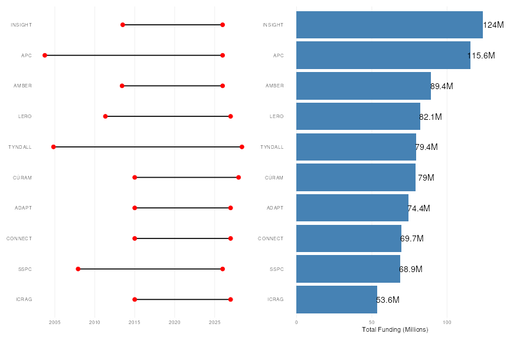

``` r
library(tidyverse)
library(tidytuesdayR)
library(mosaic)
library(tidytext)
library(sf)
library(rnaturalearth)
library(patchwork)


tuesdata <- tidytuesdayR::tt_load(2026,week = 8 )

sfi_grants <- tuesdata$sfi_grants


glimpse(sfi_grants)
```

```
## Rows: 7,269
## Columns: 12
## $ start_date                  <date> 2001-10-01, 2001-10-01, 2001-10-01, 2001-11-01, 2001-12-01, 2001-12-01, 2001-12-01, 2001-12…
## $ end_date                    <date> 2007-03-31, 2006-12-04, 2006-12-04, 2007-04-04, 2006-11-05, 2007-05-04, 2006-11-05, 2006-11…
## $ proposal_id                 <chr> "00/PI.1/B038", "00/PI.1/B045", "00/PI.1/B052", "00/PI.1/C067", "00/PI.1/C017", "00/PI.1/C02…
## $ programme_name              <chr> "Principal Investigator Programme", "Principal Investigator Programme", "Principal Investiga…
## $ sub_programme               <chr> NA, NA, NA, NA, NA, NA, NA, NA, NA, NA, NA, "Fellow Award", "Fellow Award", "Fellow Award", …
## $ supplement                  <chr> NA, NA, NA, NA, NA, NA, NA, NA, NA, NA, NA, NA, NA, NA, NA, NA, NA, NA, NA, NA, NA, NA, NA, …
## $ research_body               <chr> "Trinity College Dublin (TCD)", "Trinity College Dublin (TCD)", "Trinity College Dublin (TCD…
## $ research_body_ror_id        <chr> "https://ror.org/02tyrky19", "https://ror.org/02tyrky19", "https://ror.org/02tyrky19", "http…
## $ funder_name                 <chr> "Science Foundation Ireland", "Science Foundation Ireland", "Science Foundation Ireland", "S…
## $ crossref_funder_registry_id <chr> "10.13039/501100001602", "10.13039/501100001602", "10.13039/501100001602", "10.13039/5011000…
## $ proposal_title              <chr> "Establishing functional proteomic maps of proteins involved in apoptosis", "Pathogen-derive…
## $ current_total_commitment    <dbl> 5471668.0, 8069351.7, 5632098.2, 7939335.1, 2993354.6, 7567188.7, 7785757.1, 7458077.0, 6343…
```

``` r
df <- sfi_grants |> 
  mutate(
    funding_1k = current_total_commitment / 1000,
    length = round(time_length(interval(start_date, end_date), "years"),2),
    funding_per_year = round(funding_1k / length, 0)
  )

centers <- c("INSIGHT", "AMBER", "CÚRAM", "ADAPT", "CONNECT", 
             "Lero", "APC", "BiOrbic", "SSPC", "iCRAG", 
             "IPIC", "VistaMilk", "MaREI", "I-Form", "FutureNeuro",
             "Confirm", "Tyndall", "CRANN", "REMEDI", "BDI", "CTVR")

center_pattern <- paste0("(", paste(centers, collapse = "|"), ")")

total_funding_summary <- df %>%
  mutate(
    clean_name = case_when(
      str_detect(proposal_title, regex(center_pattern, ignore_case = TRUE)) ~ 
        str_extract(proposal_title, regex(center_pattern, ignore_case = TRUE)),
      
      TRUE ~ proposal_title
    ),
    clean_name = ifelse(clean_name %in% centers, toupper(clean_name), clean_name)
  ) %>%
  group_by(clean_name) %>%
  summarise(
    total_funding = sum(current_total_commitment, na.rm = TRUE),
    start_date = min(start_date, na.rm = TRUE),
    end_date = max(end_date, na.rm = TRUE),
    length_years = round(time_length(interval(start_date, end_date), "years"), 2),
    records_combined = n(),
    original_names = paste(unique(proposal_title), collapse = "; "),
    .groups = "drop"

  ) %>%
  arrange(desc(total_funding)) 


head(total_funding_summary,20)
```

```
## # A tibble: 20 × 7
##    clean_name  total_funding start_date end_date   length_years records_combined original_names                                   
##    <chr>               <dbl> <date>     <date>            <dbl>            <int> <chr>                                            
##  1 INSIGHT        123958891. 2013-07-01 2025-12-31        12.5                25 "INSIGHT - Irelands Big Data and Analytics Resea…
##  2 APC            115562882. 2003-10-01 2025-12-31        22.2                25 "CSET APC: Alimentary Pharmabiotic Centre; CSET …
##  3 AMBER           89433719. 2013-06-01 2025-12-31        12.6                17 "Advanced Materials and BioEngineering Research …
##  4 LERO            82111900. 2011-05-01 2026-12-31        15.7                 7 "CSET LERO: The Irish Software Engineering Resea…
##  5 TYNDALL         79368015. 2004-11-01 2028-05-31        23.6                19 "Tyndall National Institute: Capital Programme Y…
##  6 CÚRAM           78984026. 2015-01-01 2027-12-31        13                   4 "CÚRAM - Centre for Research in Medical Devices;…
##  7 ADAPT           74355673. 2015-01-01 2026-12-31        12                  12 "ADAPT: Centre for Digital Content Platform Rese…
##  8 CONNECT         69712845. 2015-01-01 2026-12-31        12                   6 "CONNECT: The Centre for Future Networks & Commu…
##  9 SSPC            68886078. 2007-12-01 2025-12-31        18.1                17 "SRC SSPS: Solid State Pharmaceuticals Cluster (…
## 10 ICRAG           53586971. 2015-01-01 2026-12-31        12                   6 "Irish Centre for Research in Applied Geoscience…
## 11 MAREI           48403971. 2013-06-01 2025-12-31        12.6                 7 "Marine Renewable Energy Ireland (MaREI) - The S…
## 12 VISTAMILK       46964039. 2018-09-01 2030-08-31        12                   8 "VistaMilk Centre; VistaMilk; VistaMilk Phase II"
## 13 BIORBIC         45881635  2017-10-01 2029-09-30        12                   2 "Bioeconomy Research Centre (BiOrbic); BiOrbic_P…
## 14 CTVR            43765261. 2004-07-01 2016-12-31        12.5                 4 "CSET CTVR: Centre for Telecommunications Value …
## 15 CRANN           42772874. 2003-05-01 2013-12-31        10.7                 8 "CSET CRANN: Centre for Research on Adaptive Nan…
## 16 I-FORM          40419448. 2017-11-01 2029-10-31        12                   5 "I-Form Advanced Manufacturing Research Centre; …
## 17 BDI             38471080. 2003-12-01 2016-03-31        12.3                 9 "CSET BDI: Center for Future Diagnostics and Hea…
## 18 FUTURENEURO     33605729. 2017-10-01 2029-09-30        12                   5 "FutureNeuro; FutureNeuro_Phase2"                
## 19 CONFIRM         32346559. 2017-10-01 2024-10-31         7.08                5 "Confirm Centre for Smart Manufacturing"         
## 20 REMEDI          28752994. 2004-01-01 2015-06-30        11.5                 4 "CSET REMEDI: Regenerative Medicine Institute (R…
```

``` r
top_projects <- total_funding_summary |> 
  slice_max(total_funding, n = 10) |>
  mutate(clean_name = fct_reorder(clean_name, total_funding))

plot_dates <- top_projects |>
  pivot_longer(cols = c(start_date, end_date), names_to = "date_type", values_to = "date")
```


``` r
# theme

# theme_set(theme_minimal())
#
# theme_update(
#   plot_margin = margin(25, 15, 15, 25),
#   panel.grid.major.x = element_line(color = "grey94"),
#   panel.grid.major.y = element_blank(),
#   panel.grid.minor =  element_blank(),
#
# )


ireland <- ne_states(country = "ireland", returnclass = "sf")

ggplot(data = ireland) +
  geom_sf(fill = "transparent", color = "darkgreen") +
  theme_void()
```



``` r
# Fetch all of UK and Ireland
world <- ne_countries(scale = "medium", returnclass = "sf")
island_of_ireland <- world[world$name %in% c("Ireland", "United Kingdom"), ]


p1 <- ggplot(top_projects, aes(y = clean_name)) +
  geom_segment(aes(x = start_date, xend = end_date, yend = clean_name), size = 0.8) +
  geom_point(data = plot_dates, aes(x = date), color = "red", size = 3, legend = NA)+
  theme_minimal() +
  theme(
  axis.title = element_blank(),
  plot_margin = margin(25, 15, 15, 25),
  panel.grid.major.x = element_line(color = "grey94"),
  panel.grid.major.y = element_blank(),
  panel.grid.minor =  element_blank(),
  )
  

p2 <- ggplot(top_projects, aes(y = clean_name, x = total_funding / 1e6)) +
  geom_bar(stat = "identity", fill = "steelblue") +
  geom_text(aes(label = paste0(round(total_funding / 1e6, 1), "M")), 
            position = position_nudge(x = 7), color = "black", size = 5, ) +
  theme_minimal() +
  labs(x = "Total Funding (Millions)", y = NULL) +
  theme(
    plot_margin = margin(25, 15, 15, 25),
    panel.grid.major.x = element_line(color = "grey94"),
    panel.grid.major.y = element_blank(),
    panel.grid.minor =  element_blank(),
    )


p1 + p2
```


